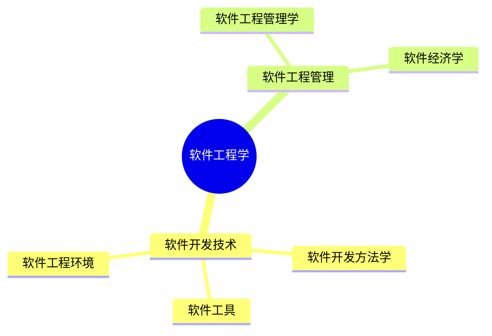

> 😃 软件工程是一个广泛的领域，涵盖了许多不同的概念和主题。
>
> - 学科
> - 高等院校专业
> - 一级学科
> - 国家级一流本科课程
> - 中国软件行业协会会刊
>
> 本文主要研究软件工程的**学科**概念

    - 学科
    - 高等院校专业
    - 一级学科
    - 国家级一流本科课程
    - 中国软件行业协会会刊

    本文主要研究软件工程的**学科**概念

# 整理定义

## 定义归纳

| 定义                                                                                                                                                                                                     | 出处                                                                                                                                |
| -------------------------------------------------------------------------------------------------------------------------------------------------------------------------------------------------------- | ----------------------------------------------------------------------------------------------------------------------------------- |
| 软件工程是一门应用计算机科学理论和技术以及工程管理原则和方法，按预定的质量和进度，组织人、机、资料等资源，进行软件需求分析、设计、编程、测试和维护等有关活动，以达到满足用户需求的软件产品和过程的学科。 | [**百度百科**](https://baike.baidu.com/item/%E8%BD%AF%E4%BB%B6%E5%B7%A5%E7%A8%8B/10172)                                             |
| 软件工程是将系统化的、规范化的、可定量的方法应用于软件的开发、运行和维护的过程，即将工程化应用于软件中。                                                                                                 | [**维基百科**](https://zh.wikipedia.org/wiki/%E8%BD%AF%E4%BB%B6%E5%B7%A5%E7%A8%8B)                                                  |
| 软件工程是一种技术和管理复合型的工程化学科，它的研究内容是如何在规定的时间和预算内，有效地开发出高质量的软件系统。                                                                                       | [**中国计算机学会（CCF）**](https://www.ccf.org.cn/c/2006-09-19/103744.shtml)                                                       |
| 软件工程是一门涵盖了从系统需求分析和规格说明，到系统设计，编程，测试，维护等所有软件生命周期活动的学科。                                                                                                 | [**《软件工程》教科书，Roger S. Pressman**](https://www.amazon.com/Software-Engineering-Practitioners-Roger-Pressman/dp/0078022126) |
| 软件工程是一门研究和应用如何有效地构造和维护大型系统的学科。                                                                                                                                             | [**IEEE Computer Society**](https://www.computer.org/technical-committees/software-engineering/)                                    |
| 软件工程是指应用计算机科学、数学及管理学等原理，以工程化的原则和方法来解决软件开发、维护、管理等多方面的原理、方法、工具与环境。                                                                         | 《软件设计师教程》（第 5 版）                                                                                                       |

## 拓展

### 软件危机

早期的软件主要指程序，程序的开发采用个体工作方式，开发工作主要依赖开发人员的个人技能和程序员设计技巧。当时的软件通常缺少与程序有关的文档，软件开发的实际成本和进度往往与预计的相差甚远，软件的质量得不到保证，开发出来的软件常常不能使用户满意。随着计算机应用需求的不断增长，软件的规模也越拉越大，然而软件开发的生产率远远跟不上计算机应用的迅速增长。此外，由于软件开发时缺少好的方法指导和工具辅助，同时又缺少相关文档，使得大量已有的软件难以维护。上述这些问题严重阻碍了软件的发展，在 20 世纪 60 年代中期，人们把上述软件开发和维护过程中所遇到的各种问题称为“软件危机”。

### 首次提出

**软件工程概念首次提出**：1968 年，在德国召开的 NATO（North Atlantic Treaty Organization，北大西洋公约组织）会议上首次提出了“软件工程”这个名词，希望用工程化的原则和方法来克服软件危机。

### 软件工程学

### 软件工程领域分类

软件工程可以根据不同的角度进行分类。以下是一些常见的分类方式：

1. **根据软件工程的阶段**：软件工程可以被分为几个主要的阶段，包括需求分析、系统设计、编程、测试、维护等。每个阶段都有其特定的目标和方法。
2. **根据软件工程的方法**：软件工程的方法可以分为结构化方法、面向对象方法、面向服务的方法等。这些方法都有其特定的理论基础和实践方法。
3. **根据软件工程的应用领域**：软件工程可以应用于各种领域，包括企业系统、嵌入式系统、网络应用、移动应用等。每个领域都有其特定的需求和挑战。
4. **根据软件工程的管理方法**：软件工程的管理方法可以分为传统的瀑布模型、迭代模型、敏捷开发模型等。这些模型都有其特定的管理理念和实践方法。
5. **根据软件工程的质量保证方法**：软件工程的质量保证方法可以分为软件测试、软件审计、软件度量等。这些方法都有其特定的目标和方法。

以上分类方式并不是互斥的，一个软件工程项目可能会同时涉及到多个阶段、使用多种方法、应用于多个领域、采用多种管理方法和质量保证方法。

# 复述展开

首先，根据上述的多个定义，我们可以得出：软件工程一门**学科**。它是属于计算机科学的一门学科。

其次，结合 [Day2 【概念解析】软件](https://www.notion.so/25d2c91d60c44fc994e6a8d405fb51f1) 的梳理，我们将软件工程进行分解，软件工程=软件+工程。类比于其他的 【XX 工程】概念，【软件工程】可以理解为，将【软件】进行【工程化】的学科。所以，<u>将软件开发的过程进行工程化展开来实施，就是软件工程的范畴</u>。——【这个理解是来自我在大学本科中软件工程这门课的老师所述】

最后，概括以下，就是软件工程是一门将工程化的思想（计算机科学理论等）运用在<u>软件开发</u>过程中的学科。

# 理解体会

1、软件工程的概念在不同领域拥有不同的概念，它可以是一门学科，也可以一门专业，甚至有期刊的名称就是软件工程，还是在很多出版社出版的书籍《软件工程》，对于这种一词多意的情况，我个人建议是从主要的领域概念入手，不贪多，不冒进，暂时保留其他的概念，后续再详细分析。

2、软件工程作为一门学科，它包含了很多的内容，甚至是一本书都无法囊括所有，可以通过有选择的筛选主干知识，对于一些细枝末节，按需去探索。

> 📌 **快速跳转链接**  
> 【概念解析】启动
>
> 【概念解析】Day 1 - 10
>
> 【概念解析】Day 11 - 20
>
> 【概念解析】Day 21 - 30
>
> 【概念解析】Day 31 - 40
>
> 【概念解析】Day 41 - 50
>
> 【概念解析】Day 51 - 60
>
> 【概念解析】Day 61 - 70

【概念解析】启动

[bookmark](https://kuangyichen.com/article/industry)

[bookmark](https://kuangyichen.com/article/start-industry-100-words)

【概念解析】Day 1 - 10

[bookmark](https://kuangyichen.com/article/industry-day1)

[bookmark](https://kuangyichen.com/article/industry-day2)

[bookmark](https://kuangyichen.com/article/industry-day3)

[bookmark](https://kuangyichen.com/article/industry-day4)

[bookmark](https://kuangyichen.com/article/industry-day5)

[bookmark](https://kuangyichen.com/article/industry-day6)

[bookmark](https://kuangyichen.com/article/industry-day7)

[bookmark](https://kuangyichen.com/article/industry-day8)

[bookmark](https://kuangyichen.com/article/industry-day9)

[bookmark](https://kuangyichen.com/article/industry-day10)

【概念解析】Day 11 - 20

[bookmark](https://kuangyichen.com/article/industry-day11)

[bookmark](https://kuangyichen.com/article/industry-day12)

[bookmark](https://kuangyichen.com/article/industry-day13)

[bookmark](https://kuangyichen.com/article/industry-day14)

[bookmark](https://kuangyichen.com/article/industry-day15)

[bookmark](https://kuangyichen.com/article/industry-day16)

[bookmark](https://kuangyichen.com/article/industry-day17)

[bookmark](https://kuangyichen.com/article/industry-day18)

[bookmark](https://kuangyichen.com/article/industry-day19)

[bookmark](https://kuangyichen.com/article/industry-day20)

【概念解析】Day 21 - 30

[bookmark](https://kuangyichen.com/article/industry-day21)

[bookmark](https://kuangyichen.com/article/industry-day22)

[bookmark](https://kuangyichen.com/article/industry-day23)

[bookmark](https://kuangyichen.com/article/industry-day24)

[bookmark](https://kuangyichen.com/article/industry-day25)

[bookmark](https://kuangyichen.com/article/industry-day26)

[bookmark](https://kuangyichen.com/article/industry-day27)

[bookmark](https://kuangyichen.com/article/industry-day28)

[bookmark](https://kuangyichen.com/article/industry-day29)

[bookmark](https://kuangyichen.com/article/industry-day30)

【概念解析】Day 31 - 40

[bookmark](https://kuangyichen.com/article/industry-day31)

[bookmark](https://kuangyichen.com/article/industry-day32)

[bookmark](https://kuangyichen.com/article/industry-day33)

[bookmark](https://kuangyichen.com/article/industry-day34)

[bookmark](https://kuangyichen.com/article/industry-day35)

[bookmark](https://kuangyichen.com/article/industry-day36)

[bookmark](https://kuangyichen.com/article/industry-day37)

[bookmark](https://kuangyichen.com/article/industry-day38)

[bookmark](https://kuangyichen.com/article/industry-day39)

[bookmark](https://kuangyichen.com/article/industry-day40)

【概念解析】Day 41 - 50

[bookmark](https://kuangyichen.com/article/industry-day41)

[bookmark](https://kuangyichen.com/article/industry-day42)

[bookmark](https://kuangyichen.com/article/industry-day43)

[bookmark](https://kuangyichen.com/article/industry-day44)

[bookmark](https://kuangyichen.com/article/industry-day45)

[bookmark](https://kuangyichen.com/article/industry-day46)

[bookmark](https://kuangyichen.com/article/industry-day47)

[bookmark](https://kuangyichen.com/article/industry-day48)

[bookmark](https://kuangyichen.com/article/industry-day49)

[bookmark](https://kuangyichen.com/article/industry-day50)

【概念解析】Day 51 - 60

[bookmark](https://kuangyichen.com/article/industry-day51)

[bookmark](https://kuangyichen.com/article/industry-day52)

[bookmark](https://kuangyichen.com/article/industry-day53)

[bookmark](https://kuangyichen.com/article/industry-day54)

[bookmark](https://kuangyichen.com/article/industry-day55)

[bookmark](https://kuangyichen.com/article/industry-day56)

[bookmark](https://kuangyichen.com/article/industry-day57)

[bookmark](https://kuangyichen.com/article/industry-day58)

[bookmark](https://kuangyichen.com/article/industry-day59)

